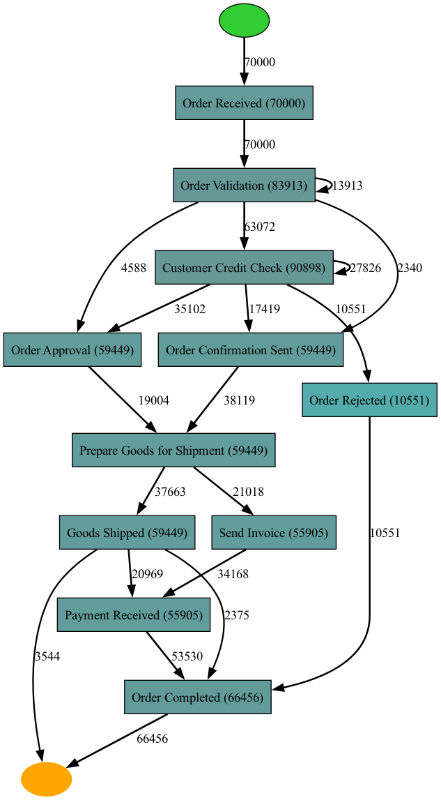

# Paper repository
Repo for development of an LLM-based agent that can generate domain knowledge for process mining. This repository functions as the Proof-of-Concept (PoC) for the paper that I co-authored for the Workshop on Generative AI for Process Mining at the International Conference on Process Mining (ICPM) 2024. This paper is based on my master thesis for the MSc 'ICT in Business' at Leiden University in 2024. This repo was made as a copy of the active repo, to allow readers of the paper to see the prototype and the results of the experiments. For more details on the project, you can take a look at my full thesis (access can be given upon request).

## Folder structure
1. Event_Logs: contains the used event logs
2. Prototype: contains the code of the PoC
3. Experiments: contains the setup and outputs of the conducted experiments

## PoC concept
Researching if LLMs can supplement domain knowledge (about the sector, organization, process, etc.) into process mining tools and whether this offers additional value compared to the current status of these tools. The system is a multi-level agent, based on GPT-4 Turbo and GPT-3.5 Turbo.

### Input
1. event log
2. name of the organisation
3. type of process
4. preferred technique (not mandatory)

### Output
1. generated process model (BPMN, Petri net, Heuristic net, etc.)
2. found relevant process components
3. potential explanations/ causes for issues at these components
4. potential remediations for these issues
5. the generated graph of the used agent

## Programming languages
Main language is Python.

## Architecture PoC
### Flow

### Components

## Example of input and output
### Example of input
"Can you find the audit risks in the process based on the following event log, filepath='local_file_path'? This is an order to cash process at Procter & Gamble (P&G). What are the audit risks for specific steps that you identified? Please use the DFG approach for process discovery."

### Sample of output
The reports that the agent generates are often around 10 pages, an example of what a report contains:
Segregation of Duties
Segregation of duties is a key internal control that reduces the risk of errors and fraud. In the 'Send Purchase Order -> Receive Goods' step, the risk arises when the same individual is responsible for both ordering goods and receiving them. This lack of segregation can lead to unauthorized purchases or the acceptance of substandard goods. Procter & Gamble must ensure that different employees handle the procurement and receiving processes to mitigate this risk. ([Procter & Gamble Policies & Practices](https://us.pg.com/policies-and-practices/product-safety-and-compliance/))

Authorization of Purchase Orders
Unauthorized purchase orders can lead to financial losses and non-compliance with company policies. It is crucial that all purchase orders at Procter & Gamble are reviewed and authorized by appropriate personnel before being sent to suppliers. The risk is that unauthorized or fraudulent orders may be processed, leading to unnecessary expenditures or receipt of non-required goods. ([Procter & Gamble Third-Party Risk Management](https://pgsupplier.com/news/new-third-party-risk-management-tprm-process-makes-its-debut))

Verification of Goods Received
Upon receipt of goods, there is a risk that the items may not match the purchase order in terms of quantity, quality, or specifications. Procter & Gamble must have controls in place to verify that the goods received are as per the order. This includes checking the delivery against the purchase order and packing slip, and inspecting the goods for damage or defects. Failure to do so can result in inventory discrepancies, financial losses, and potential issues with product safety and compliance. ([Procter & Gamble Product Safety & Compliance](https://us.pg.com/policies-and-practices/product-safety-and-compliance/))

The process model and statistics about the process model can also be visualized by the agent, e.g.:

### Agent graph

## Main components
### LangChain
LangChain is used as the basis for this prototype, LangChain is a widely used open-source library for building LLM-based applications. For this prototype LangChain is used to build the agent that executes the given tools to generate the mentioned output. 
For more info, see https://www.langchain.com

### Tavily GPT-Researcher
For gathering more complex information from the internet the Tavily GPT-Researcher is used as one of the tools for the agent. This function requires a different version of LangChain compared to some other used functions. Therefore this tool runs in a separate virtual environment, see architecture. This tool generates a research report based on a provided quer and has the following architecture:

### REWOO
Reason without observation, is a novel approach for building LLM agents proposed by Xu, et. al. This approach builds on the concepts of ReAct and Plan and Solve prompting and results in more efficient agents that use less tokens and LLM calls. REWOO uses a multi-step planner and variable substitution for effective tool use. It was designed to improve on the ReACT-style agent architecture.

The REWOO paper: https://arxiv.org/abs/2305.18323
The concept of REWOO visualized:

